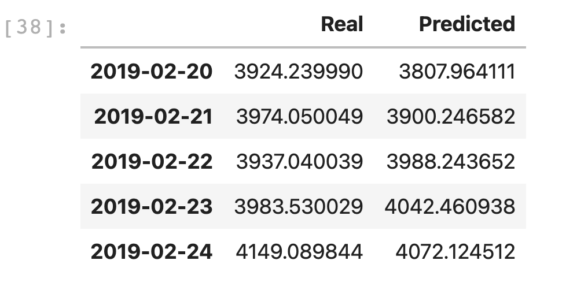
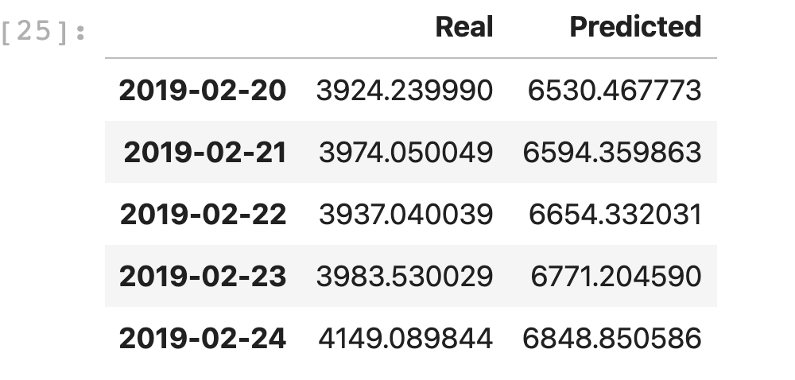

# LSTM Stock Predictor

This project is using 2 approaches to predict the price of Bitcoin on 11th day based on the price in the last 10 days

1) Closing Price Model
2) Fear And Greed Index

Based on the Closing Price Model, the following image shows the real and predicated values

Based on the Fear and Greed Index Model, the following image shows the real and predicated values

